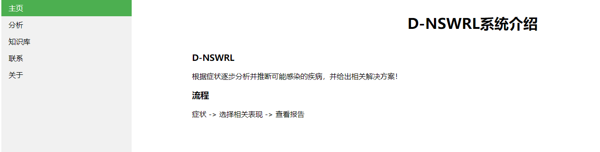
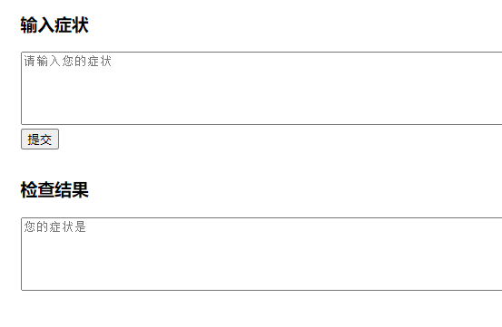
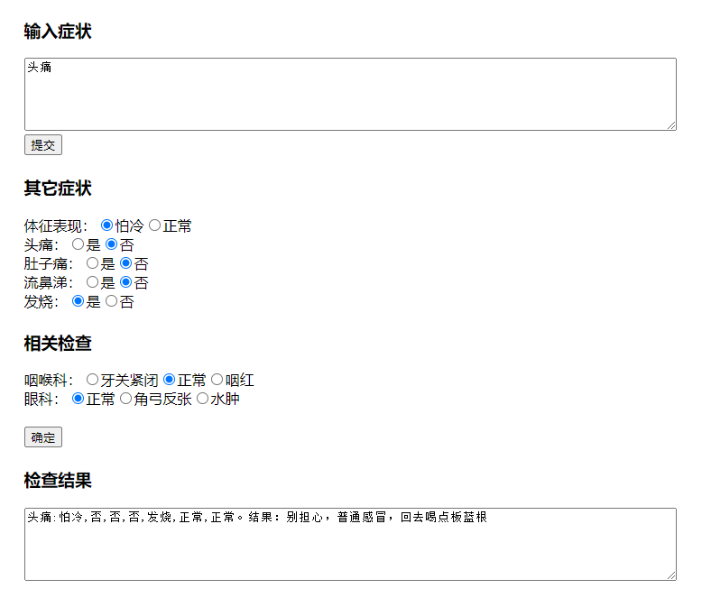

# DNSWRL
DNSWRL的初始版本 - Node版本
DNSWRL:Dynamic no description logic

其它版本：
[DNSWRL-python](https://github.com/DNSWRL/DNSWRL-python)

# Usage
```shell
node server.js
```
然后在浏览器打开 localhost:8088

# 样例图


